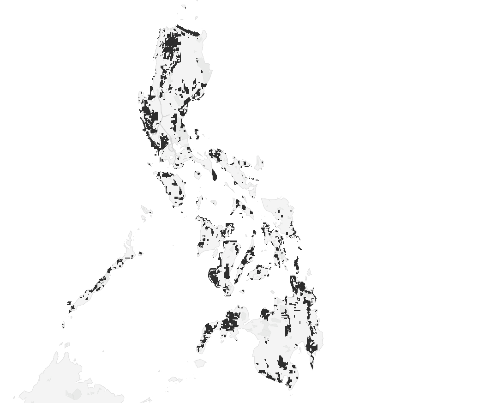
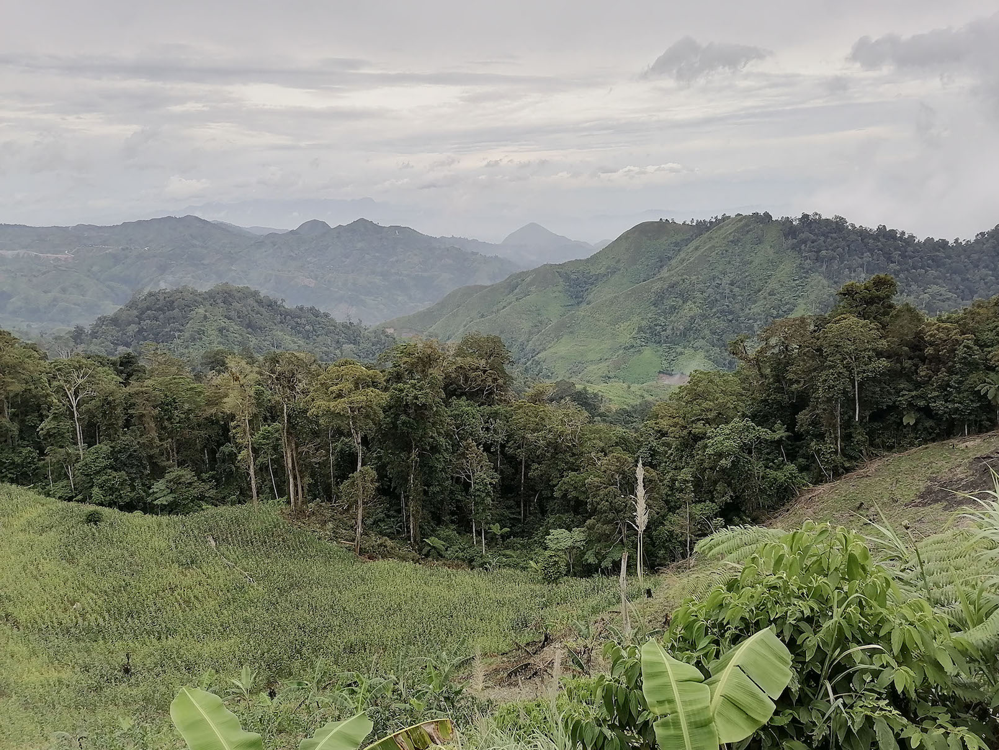
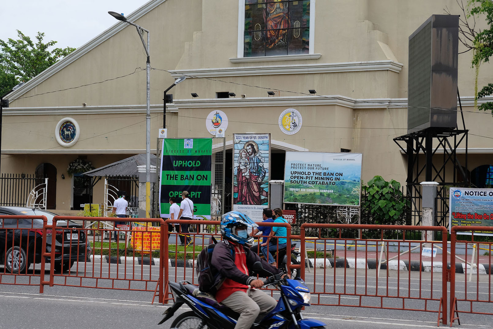

> Larawan ni [Dominik Vanyi](https://unsplash.com/@dominik_photography?utm_content=creditCopyText&utm_medium=referral&utm_source=unsplash) sa [Unsplash](https://unsplash.com/photos/photography-of-excavators-at-mining-area-Mk2ls9UBO2E?utm_content=creditCopyText&utm_medium=referral&utm_source=unsplash)

Ang Pilipinas ay nakararanas ng isang "Mining Boom" na bunga sa tumataas na pandaigdigang pangangailangan para sa mahahalagang mineral tulad ng nikel at tanso.
Ito ay mahalaga para sa mga teknolohiyang nababago at mga de-kuryenteng sasakyan (Global Witness, 2024b).
Sa ngayon, higit pa sa ikalimang bahagi ng lupa ng Pilipinas ay ginagamit para sa iba't ibang operasyong pagmimina, kadalasan malaki ang pag-uugat sa mga katutubing ninunong teritoryo at mga lugar na hitik sa biodiversity.

Subalit, sa likod ng pangako na ito ay may tinatagong katotohanan ng kaharasan at pang-aapi.
Ayon sa Global Witness (2024a), sa mga taong 2012-2023, higit sa 117 na indigenous environmental defenders ay namatay sa Pilipinas at ang militar ay may kasalanan sa kalahati ng mga ito.
Ang militarisasyon ng mga rehiyon ng pagmimina ay pinalakas, kung saan ang mga puwersa ng estado ay kasangkot sa 88% ng mga pagpatay sa mga tagapagtanggol na naitala noong 2023 lamang.
Dagdag pa dito, kahit na mayroon nang Indigenous Peoples' Rights Act (IPRA) na nagbibigay ng Free Prior and Informed Consent (FPIC) sa mga apektado na komunidad bago kahit anong klaseng pagmimina ang mangyari, ito ay madalas na ini-iwasan, minamanipula o mahirap ipatupad ng mga kumpanya at ahensya ng gobyerno.
Ito ay karaniwang pabor sa interes ng korporasyon kaysan sa mga karapatan ng komunidad (Wetzlmaier, 2020).

Isang halimbawa ng tunggalian sa pagitan ng mga malalaking korporasyon at ng karapatan ng mga katutubong mamamayan ang isyu sa Tampakan project, isang nakatakdang proyekto ng pagmimina ng ginto at tanso sa South Cotabato, Mindanao.
Inilunsad ng Sagittarius Mines, Inc. ang proyektong ito sa lupang ninuno ng mga katutubong Blaan, na nagdulot ng sigalot ukol sa karapatan sa lupa, pangangalaga sa kalikasan, at pag-iral ng pamumuhay doon.
Kung maisasakatuparan, inaasahang magiging isa ito sa pinakamalaking minahan ng tanso at ginto sa buong Timog-Silangang Asya.
Ayon kay Nora Sukal, isa sa mga lider sa lupang ninuno na saklaw ng S’bangken Tribal Council, magdudulot ang proyekto na ito ng matinding epekto sa kanilang tribo tulad ng sapilitang paglikas ng tinatayang nasa 5,000 katao.
Dagdag pa niya, malalayo ang mga Blaan sa gubat na siyang pinagkukunan nila ng pagkain kapag nagugutom, gamot kapag may sakit, at banal na lugar kung saan sila ay nagpupugay sa kanilang mga diyos. (Sarmiento, 2022)

Ang proyekto ng pagmimina sa Tampakan ay sinasabing sangkot sa paglabag sa karapatang pantao at matinding militarisasyon laban sa mga Blaan.
Isa na sa mga nagbuwis ng buhay si Gurilmin Malid, isang tribal leader sa Blaan, kasama ang kanyang menor de edad na kasamahan matapos silang tambangan sa loob ng development site noong Hulyo 2002.
Mula noon, mahigit dalawampung katao na rin ang napatay na dahil umano sa mga "lehitimong operasyong militar."
Nagsimula rin ang pagpapadala ng militar ng mga sundalo at armadong grupo para sugpuin ang sinumang tutol sa proyekto.
Mayroon ding mga armadong gwardya na itinalaga upang bantayan ang minahan.
Sa kabila nito, ilang miyembro ng tribong Blaan ay nanatiling aktibo sa pagtutol sa proyektong ito. Pinangungunahan ito ng Simbahang Katoliko sa lugar, na sinuportahan ng iba’t ibang environmental at civic groups.
Ang kanilang pagtutol ay naipakita sa matinding suporta sa mga inisyatiba tulad ng kampanya ng Simbahan na mangalap ng mga pirma upang panatilihin ang pagbabawal sa open-pit mining sa South Cotabato. (Sarmiento, 2022)

Pinapakita ng pagkasabay ng militarisasyon at pagpapalayas ng kultura na mas malaki ang problema sa kasalukyan---ipinapakita ang mga kabiguan sa karapatang pantao at etikal na pagkukulang sa Pilipinas.
Ang isang tunay na pagtransisyon sa napapanatiling enerhiya ay dapat unahin ang demilitarisasyo ng pagkuha ng mga yaman, at ipagtanggol ang mga prinsipyo ng FPIC.
Ang kinabukasan ng pagmimina sa Pilipina ay kailangang tumanggi sa kaharasan at pagsasamantala, at sa halip ay yakapin ang katarungan, integridad ng kultural, at pagpapanayili ng kalikasan.

## Sanggunian

  
<i>How mining threatens Indigenous defenders in the Philippines</i>. (2024, December 3). Global Witness. <a href="https://globalwitness.org/en/campaigns/land-and-environmental-defenders/how-the-militarisation-of-mining-threatens-indigenous-defenders-in-the-philippines/">https://globalwitness.org/en/campaigns/land-and-environmental-defenders/how-the-militarisation-of-mining-threatens-indigenous-defenders-in-the-philippines/</a>

  
  
<i>Rush for critical minerals threatens indigenous communities</i>. (2024, December 3). Global Witness. <a href="https://globalwitness.org/en/press-releases/rush-for-critical-minerals-in-philippines-threatens-indigenous-communities-and-biodiversity/">https://globalwitness.org/en/press-releases/rush-for-critical-minerals-in-philippines-threatens-indigenous-communities-and-biodiversity/</a>

  
  
Sarmiento, B. S. (2022, February 28). <i>‘I am pro-mining’: Indigenous opposition to Philippine mine project falters</i>. Mongabay Environmental News. <a href="https://news.mongabay.com/2022/02/i-am-pro-mining-indigenous-opposition-to-philippine-mine-project-falters/">https://news.mongabay.com/2022/02/i-am-pro-mining-indigenous-opposition-to-philippine-mine-project-falters/</a>

  
  
Wetzlmaier, M. (2012). Cultural impacts of mining in indigenous peoples’ ancestral domains in the philippines. <i>Austrian Journal of South-East Asian Studies</i>, 335-344 Pages. <a href="https://doi.org/10.14764/10.ASEAS-5.2-9">https://doi.org/10.14764/10.ASEAS-5.2-9</a>

  

