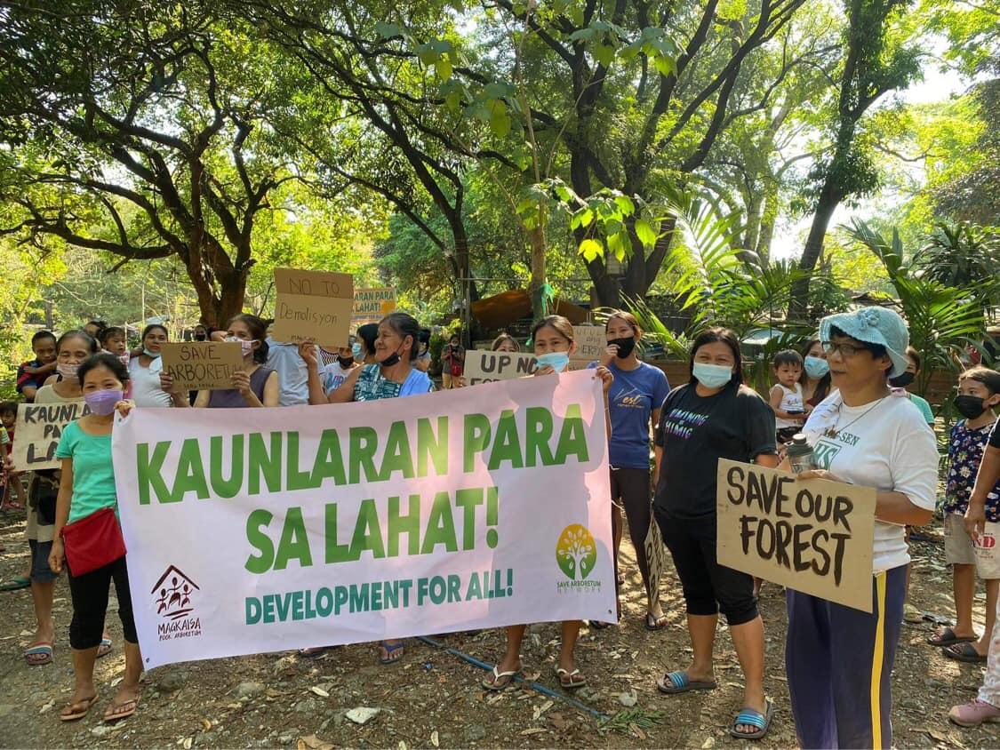

> Larawan ng [DENR-Biodiversity Management Bureau](https://www.facebook.com/photo?fbid=2933650373628681&set=a.2933801493613569) sa [Facebook](https://www.facebook.com/denr.biodiversity)

Ang UP Arboretum o mas kilala bilang Pook Arboretum ang huling gubat o “urban forest” sa Metro Manila (DENR-Biodiversity Management Bureau, 2021).
Ayon sa ulat ni Laurico (2025), sa ilalim ng 2012 Land Use Development and Infrastructure Plan (LUDIP) ng UP Diliman, tinagurian bilang isang “protected forest area” ang Pook Arboretum.
Maliban sa klasipikasyong ito, nagsisilbi ring tahanan para sa halos anim na daang (600) pamilya ang Pook Arboretum (Lauricio, 2025).

Hindi lang isang gubat at tahanan para sa marami ang UP Arboretum, bagkus, sa gitna ng lumalalang polusyon at lumiliit na berdeng espasyo sa Kalakhang Maynila, nananatili itong isang huling kaagapay ng kalikasan.
Subalit, sa ngayon, tila nababalot ito ng banta, hindi mula sa mga natural na kalamidad, kundi mula sa nagbabadyang komersyalisasyon ng lupang kinalalagyan ng Arboretum at banta mula sa kamay ng mga ganid na opisyales ng UP at ng pamahalaan.

Opisyal na isinapubliko ng UP Diliman ang planong pagpapatayo ng UP-Philippine General Hospital Complex sa Pook Arboretum noong Marso 2022 (UP Media and Public Relations Office, 2022).
Ayon sa naturang plano na nabanggit ng UP Media and Public Relations Office (2022), apat na ektarya ng lupa ang ilalaan para sa nasabing ospital, habang ang natitirang limang ektarya ay nakalaan sa hinaharap na pagpapalawak ng lupa na hanggang ngayon ay malabo pa rin kung para saan.
Ngunit sa kabila ng tila makataong layunin ng proyekto, higit 600 pamilyang nakatira sa lugar ang direktang maaapektuhan nito.

Hindi maipagkakaila na malaki ang maitutulong ng pagpapatayo ng naturang ospital.
Hindi naman tutol ang karamihan sa pangangailangang medikal lalo pa’t mayroon tayong kakulangan sa mga pampublikong ospital.
Ngunit, hindi rin natin maitatanggi ang pangamba ng ganitong proyekto lalo pa at walang naging abiso lalo na sa mga pagbabakod sa paligid ng Pook Arboretum at wala ring malinaw na plano para sa permanenteng relokasyon ang mga residenteng paaalisin sa lugar (Vidor, 2022; Lauricio, 2025).
Gayundin ang pangambang tuluyang pagkasira ng natitirang berdeng espasyo sa Kalakhang Maynila. Bilang pagtanaw sa nasabi nilang hinaharap, para kanino nga ba ang pag-unlad na pinaplano nila?

## Sanggunian

  
DENR-Biodiversity Management Bureau. (2021). <i>Entry no. 17—UP Arboretum: The last remaining urban forest</i>. <a href="https://www.facebook.com/photo?fbid=2933650373628681&amp;set=a.2933801493613569">https://www.facebook.com/photo?fbid=2933650373628681&amp;set=a.2933801493613569</a>

  
  
Lauricio, A. (2025, February 28). <i>Amid spurred commercialization, stewards of remaining urban farm and forest grow increasingly wary of displacement</i>. Philippine Collegian. <a href="https://phkule.org/article/1421/amid-spurred-commercialization-stewards-of-remaining-urban-farm-and-forest-grow-increasingly-wary-of-displacement">https://phkule.org/article/1421/amid-spurred-commercialization-stewards-of-remaining-urban-farm-and-forest-grow-increasingly-wary-of-displacement</a>

  
  
UP Media and Public Relations Office. (2022, March 14). <i>UP expanding the PGH to serve more Filipinos—University of the Philippines</i>. University of the Philippines. <a href="https://up.edu.ph/up-expanding-the-pgh-to-serve-more-filipinos/">https://up.edu.ph/up-expanding-the-pgh-to-serve-more-filipinos/</a>

  
  
Vidor, Y. (2022, March 25). <i>Komunidad ng Pook Arboretum, hinarangan ang inspeksyon ng mga bidder para sa PGH Diliman</i>. Philippine Collegian. <a href="https://phkule.org/article/491/komunidad-ng-pook-arboretum-hinarangan-ang-inspeksyon-ng-mga-bidder-para-sa-pgh-diliman">https://phkule.org/article/491/komunidad-ng-pook-arboretum-hinarangan-ang-inspeksyon-ng-mga-bidder-para-sa-pgh-diliman</a>

  

